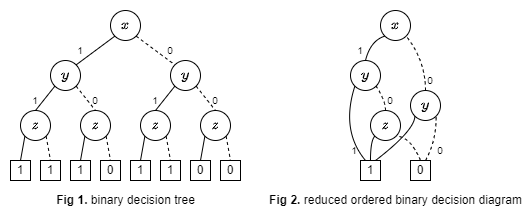
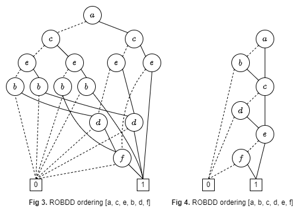

# Metaheuristic Binary Decision Diagram

# Binary Decision Diagram



A [binary decision diagram (BDD)](https://en.wikipedia.org/wiki/Binary_decision_diagram) is directed acyclic graph to represent a boolean function. BDD is useful implementational framework for some computational problems and symbolic model-checking.

First, consider the simpler form, *binary decision tree* ***(Fig 1)***. It is a tree whose non-terminal nodes are labelled with boolean variables and terminal nodes are labelled with either 0 or 1. Each non-terminal node has two edges which represent an assignment of the value 0 or 1 to its boolean variable.

BDD can be optimised into more compact form, *reduced*, ordered BDD (ROBDD) ***(Fig 2)***. BDD almost always refers to ROBDD. ROBDD is canonical (unique) for certain veriable order. This is desirable property for formal equivalence checking.


# Variable Ordering Problem



The size of the BDD is determined by boolean function and ordering of the variables. It is important to choose good variable ordering when applying BDD. It makes a significant difference to the size of BDD. See ***Fig 3*** and ***Fig 4***. Both are BDDs with same boolean function but different ordering. However ***Fig 4*** is much simple than ***Fig 3***.

The problem of finding the best variable ordering is **NP-hard**.


# Goal

* Find best BDD ordering on efficient way by metaheuristic solution.
* Apply this system to BDD-based model-checking.


# Design

## Requirements
This system requires [pyeda](https://pyeda.readthedocs.io/en/latest/overview.html) library which supports BDD structure in python.
```python
pip install pyeda
```
or
```python
pip install -r requirements.txt
```

## Parameters

POP_SIZE: size of population. (default 500)
POOL_SIZE: size of parents pool for crossover and mutation. (default 50)
nOper: number of binary operations only used for automatic boolean function generation. (default 10)

```python
nOper = 10
auto_bfunc = FormulaGenerator().genFormula(nOper)
manual_bfunc = "v[0]&v[1]|v[2]&v[3]|v[4]&v[5]"
```
This system needs a boolean function expression with &(AND), |(OR), ^(XOR), and ~(NOT) operators. [*generator.py*](./generator.py) can generate random boolean function, but you can put it in manually.

## Parameters such as the size of an initial population
```python
def createIndividual(n):
    ind = [0, 1, 2, ..., n-1]
    shuffle(ind)
    return ind

def createPopulation(nVar, psize):
    pop = [createIndividual(nVar) for _ in range(psize)]
    return pop
```

Consider a boolean function has n boolean variables. Each individual is ordering sequence of variables in boolean function. It is a shuffled list which contains all numbers 0 to n-1.

## Stopping criteria

> fixed time count (60 seconds).

## Fitness function
> Fitness is number of nodes in ROBDD. Smaller is better.

## Selection operator
Select top *POOL_SIZE* individuals, do crossover and mutation.

## Crossover operator
Currently, this system works in small size, so no crossover..

## Mutation

```python
def mutation(pop):
    newPop = pop[:POOL_SIZE]
    for ind in newPop:
        select e1, e2
        swap(e1, e2)
    return newPop
```
Create new individuals from selected top *POOL_SIZE* individuals. Each individual has ordering sequence form. Therefore mutation is swap process between two elements in individual.

## Generational selection strategy
Select top *POOL_SIZE* individuals.