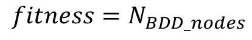
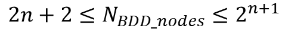

# Metaheuristic Binary Decision Diagram

# Binary Decision Diagram


A [binary decision diagram (BDD)](https://en.wikipedia.org/wiki/Binary_decision_diagram) is directed acyclic graph to represent a boolean function. BDD is useful implementational framework for some computational problems and symbolic model-checking.

First, consider the simpler form, *binary decision tree* ***(Fig 1)***. It is a tree whose non-terminal nodes are labelled with boolean variables and terminal nodes are labelled with either 0 or 1. Each non-terminal node has two edges which represent an assignment of the value 0 or 1 to its boolean variable.

BDD can be optimised into more compact form, *reduced*, ordered BDD (ROBDD) ***(Fig 2)***. BDD almost always refers to ROBDD. ROBDD is canonical (unique) for certain veriable order. This is desirable property for formal equivalence checking.


# Variable Ordering Problem


The size of the BDD is determined by boolean function and ordering of the variables. It is important to choose good variable ordering when applying BDD. It makes a significant difference to the size of BDD. See ***Fig 3*** and ***Fig 4***. Both are BDDs with same boolean function but different ordering. However ***Fig 4*** is much simple than ***Fig 3***.

The problem of finding the best variable ordering is **NP-hard**.


# Goal

* Find best BDD ordering on efficient way by metaheuristic solution.
* Apply this system to BDD-based model-checking.


# Design

## Requirements
This system requires [dd](https://github.com/tulip-control/dd) library which supports BDD structure in python.
```python
pip install dd
```
or
```python
pip install -r requirements.txt
```

## Parameters
**POP_SIZE** size of population. (default 500)

**POOL_SIZE** size of parents pool for crossover and mutation. (default 30)

**N_LIMIT** iteration limitation for stopping criteria. (default 10)

**LIMIT_RATIO** limitation ratio for setting criteria. (default 0.85)

**CRITERIA** minimum number of new offsprings which increases N_LIMIT.

## Initial Population and Individual
```python
python run.py "v0 & v1 | v2 & v3 | v4 & v5"
```
This system needs a boolean function expression with &(AND), |(OR), ^(XOR), and ~(NOT) operators. If you don't put boolean expression argument, [*generator.py*](./generator.py) may generate random boolean expression.

```python
def createIndividual(n):
    ind = [0, 1, 2, ..., n-1]
    shuffle(ind)
    return ind

def createPopulation(nVar, psize):
    pop = [createIndividual(nVar) for _ in range(psize)]
    return pop
```
Consider a boolean expression has n boolean variables. Each individual is ordering sequence of variables in boolean expression. It is a shuffled list which contains all numbers 0 to n-1.

## Stopping criteria
```python
if len(newPop) < CRITERIA:
    nIter += 1
    if nIter == N_LIMIT:
        break
pop.extend(newPop)
```
If there is not enough progress *CRITERIA*, increase iteration limitation *nIter*. When *nIter* reaches *N_LIMIT*, the process is over.

## Fitness
```python
def evaluate(bdd, vars, nVar, ind):
    ordering = {}
    for i in range(nVar):
        ordering[vars[i]] = ind[i]
    BDD.reorder(bdd, ordering)
    score = len(sample_bdd)
    return score
```
Consider there is boolean function with n boolean variables. Fitness is number of nodes in BDD. Smaller is better. 




## Selection
```python
def fps(pop):
    total_fitness = sum(fitness)
    weight = [f/total_fitness for f in fitness]
    return weight
```
Select individuals from fitness weight.

## Crossover
```python
def crossover(pop):
    newPop = []
    weight = selection_algorithm(pop)
    for 0 to POOL_SIZE:
        select aParent, bParent
        generate offsprings
        if offspring not in pop:
            newPop.append(offsprings)
    return newPop
```
Create new offspring individuals from selected *POOL_SIZE* individuals.

## Mutation

```python
def mutation(pop):
    newPop = pop
    for ind in newPop:
        select e1, e2
        swap(e1, e2)
    return newPop
```
Create new individuals from selected *POOL_SIZE* individuals. Each individual has ordering sequence form. Therefore mutation is swap process between two elements in individual.

## Generational selection strategy
```python
pop.sort(key=get_eval)
pop = pop[:POP_SIZE]
...
newPop = crossover(pop)
newPop = mutation(newPop)
pop.extend(newPop)
```
Generate all by random, but choose best.